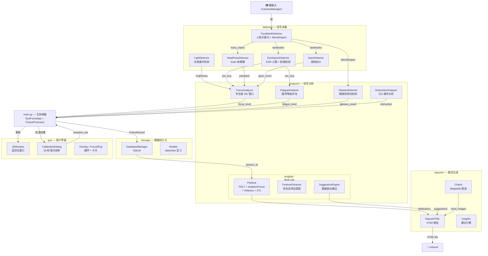

# EyeFocus Insight — 架构文档

> **版本**：v1.0 | **日期**：2026-06-13
> **目的**：描述系统整体架构、模块职责、数据流和关键技术决策。

---

## 一、系统概述

EyeFocus Insight 是一个基于 MediaPipe Face Mesh 的实时眼动追踪与疲劳检测系统。它通过摄像头捕捉用户面部图像，实时分析专注度、疲劳状态和分心行为，并在会话结束后生成 HTML 报告。

### 核心功能

| 功能 | 描述 |
|------|------|
| 实时 EAR 检测 | 基于眼部关键点的 Eye Aspect Ratio 计算，检测眨眼和眼睛闭合 |
| 头部姿态追踪 | 利用 MediaPipe 面部变换矩阵解算 yaw/pitch/roll Euler 角 |
| 专注度分级 | 基于 30s 滑动窗口 EAR 偏差统计，输出 FOCUSED/NORMAL/DISTRACTED 三档 |
| 疲劳分析 | 融合眨眼率、EAR 谷值、头部稳定性评估疲劳等级 |
| 分心识别 | 综合分析视线偏离和面部缺失的持续模式 |
| 眼镜检测 | blendshapes 眯眼比率 + 眼角距离双保险判定是否戴眼镜 |
| 光照感知 | 三级亮度分类 (DARK/NORMAL/BRIGHT)，低光照时自动降低检测阈值 |
| 离线分析 | 会话结束后运行 PELT 变点检测 + IsolationForest 异常检测 + 建议引擎 |
| HTML 报告 | 自动生成含图表、数据分析和个性化建议的报告 |

---

## 二、整体架构

### 模块关系图



### 目录结构

```
EyeFocus Insight/
├── main.py                     # 主协调器（EyeFocusApp + FrameProcessor）
├── config.py                   # 集中配置管理（dataclass）
├── CLUADE.md                   # Claude Code 项目规范（gitignored）
├── requirements.txt            # Python 依赖
├── detector/                   # 信号采集层
│   ├── __init__.py
│   ├── face_mesh.py            # MediaPipe FaceMesh 封装
│   ├── eye_aspect.py           # EAR 计算 + 眨眼检测 + 多信号融合
│   ├── head_pose.py            # 头部姿态稳定性
│   ├── light.py                # 光照条件检测
│   ├── gaze.py                 # 视线估计
│   └── README.md
├── analyzer/                   # 信号分析层
│   ├── __init__.py
│   ├── focus.py                # 专注度分析（30s 滑动窗口）
│   ├── fatigue.py              # 疲劳等级评估
│   ├── glasses.py              # 眼镜检测（blendshapes + 眼角距离）
│   ├── distraction.py          # 分心事件分析
│   ├── insights/               # 离线分析子包
│   │   ├── __init__.py
│   │   ├── pipeline.py         # 分析管线（PELT/IsolationForest/KMeans/STL）
│   │   ├── features.py         # 多会话特征提取
│   │   └── attribution.py      # 因素归因分析
│   └── tests/                  # 分析器测试
├── storage/                    # 数据持久化层
│   ├── __init__.py
│   ├── database.py             # SQLite 数据库管理
│   └── models.py               # 数据模型 dataclass（FrameRecord/Session 等）
├── calibration/                # 校准模块（v4.2，OpenCV 备用路径）
│   ├── __init__.py
│   ├── result.py               # 校准结果处理
│   └── tests/
├── gui/                        # 用户界面层
│   ├── __init__.py
│   ├── qt_window.py            # PyQt5 监测主窗口
│   ├── qt_overlay.py           # 专注度圆环 (FocusRing) + 状态卡片 (StatusCard)
│   ├── calibration_dialog.py   # Qt 校准对话框（v4.7 状态机）
│   └── video_label.py          # 视频帧显示组件
├── reporter/                   # 报告生成层
│   ├── __init__.py
│   ├── report_html.py          # HTML 报告生成器
│   ├── charts.py               # Matplotlib 图表（专注度/疲劳/分布/分心热力图）
│   └── insights.py             # 建议引擎（数据驱动 + 规则兜底）
├── tests/                      # 项目级测试
│   ├── test_glasses.py         # 眼镜检测测试（450+ 行）
│   ├── test_light.py           # 光照检测测试
│   ├── test_face_mesh.py       # 面部网格检测测试
│   ├── test_distraction.py     # 分心识别测试（20 tests）
│   ├── test_insights_unit.py   # 洞察模块单元测试（22 tests）
│   ├── test_insights_integration.py  # 洞察集成测试
│   ├── test_main_high_bugs.py  # main.py 高优 bug 回归
│   ├── test_main_medium_bugs.py      # main.py 中优 bug 回归
│   └── ...
└── docs/                       # 文档
    ├── ARCHITECTURE.md         # （本文档）
    ├── API.md                  # 公共接口文档
    ├── USER_GUIDE.md           # 用户手册
    ├── DEV_GUIDE.md            # 开发指南
    ├── MODULE_INTERFACES.md    # 模块边界标准
    ├── PYQT5_MIGRATION.md      # Qt 迁移记录
    └── old_schemes/            # 历史方案归档
```

---

## 三、数据流

### 3.1 实时数据流（~30 FPS）

```
摄像头 → FaceMeshDetector → 关键点 + blendshapes
                    │
        ┌───────────┼───────────┐
        │           │           │
   EyeAspect    HeadPose    GazeDetector   LightDetector
   Detector     Detector    │              │
        │           │       │              │
        │           │       gaze_score     brightness
        │           │       │              │
        └───────┬───┘       │              │
                │           │              │
                ▼           ▼              ▼
          FocusAnalyzer (30s 滑动窗口)
                │
                ▼
          FocusLevel: FOCUSED / NORMAL / DISTRACTED
                │
                ▼
          FatigueAnalyzer → FatigueLevel: LOW / MEDIUM / HIGH
                │
                ▼
          FrameRecord → SQLite (15 FPS 节流写入)
```

### 3.2 校准流程数据流

```
校准对话框 (Qt CalibrationDialog)
  ├── 步骤1: 睁眼基线 (5s)      → baseline_ear
  ├── 步骤2: 闭眼检测 (3s)      → blink_threshold
  ├── 步骤3: 头部姿态 (4方向×2s) → yaw_range, pitch_range
  └── 步骤4: 眨眼计数 (8s)      → blink_rate_self_report

结果 → EyeFocusApp._apply_qt_calibration_result()
  ├── EyeAspectDetector.set_baseline(baseline_ear)
  └── FocusAnalyzer.set_baseline(ear, yaw_std, pitch_std)
```

### 3.3 离线分析流（会话结束时触发）

```
DB 多会话查询
  │
  ▼
FeatureExtractor
  ├── 疲劳统计（严重/中等占比）
  ├── 分心事件（短/中/长分类 + 热力图）
  ├── 帧统计（均值/标准差/N 值）
  └── 时间特征（时段分布）
  │
  ▼
Pipeline
  ├── PELT → 变点检测
  ├── IsolationForest → 异常会话检测
  ├── KMeans → 行为模式聚类
  └── STL → 时间序列分解
  │
  ▼
AttributionAnalysis
  ├── 时段因素 / 时长因素 / 眨眼因素
  ├── 视线因素 / PERCLOS / 头部因素
  ├── 专注度波动 / 疲劳因素 / 暗光因素
  └── 效应量 (Cohen's d) + 方向判断
  │
  ▼
SuggestionEngine → 个性化建议 → HTML 报告
```

---

## 四、关键技术决策

### 4.1 MediaPipe Face Mesh 作为唯一信号源

| 决策 | 选择 | 理由 |
|------|------|------|
| 面部检测 | MediaPipe FaceMesh (XNNPACK) | CPU 推理 < 15ms，478 关键点，内置 blendshapes |
| 头部姿态 | 面部变换矩阵 Euler 分解 | 免额外模型，4×4 矩阵已含旋转信息 |
| 视线估计 | 眼部关键点几何法 | 免模型+免校准，基于 133/362 等关键点角度计算 |
| 低光照适应 | 灰度均值分类 + 阈值自适应 | 无额外依赖，自研算法 < 1ms |

### 4.2 PyQt5 GUI 替代 OpenCV HighGUI

OpenCV HighGUI 在 v4.4 前用于显示窗口，因以下问题被 PyQt5 替代：

| 问题 | OpenCV | PyQt5 |
|------|--------|-------|
| 中文显示 | 不支持 | ✅ 原生 Unicode |
| 按钮交互 | cv2.waitKey 轮询 | ✅ 信号/槽 |
| 布局 | 手动计算坐标 | ✅ QVBoxLayout/QHBoxLayout |
| 圆角/渐变 | 手动 paint | ✅ QPainter/QPainterPath |
| 模态对话框 | 不支持 | ✅ QDialog |

### 4.3 专注度评分设计诚实原则

不自欺，不用复杂模型从弱信号中强行提取 0-100 分数：

- 单一 EAR 信号 → 30s 滑动窗口 → **3 档分类** (FOCUSED/NORMAL/DISTRACTED)
- 每档映射到代表性分数 (85/55/25)
- 头部姿态和视线作为辅助权重，不直接参与评分
- 已知限制：依赖单摄像头，无法区分"看屏幕"和"思考时视线偏移"

### 4.4 SQLite 离线分析架构

所有帧数据存储在本地 SQLite，会话结束后由分析管线读取：

| 设计 | 理由 |
|------|------|
| 本地存储 | 隐私优先，0 HTTP 请求，不存储图像帧 |
| 写节流 (15 FPS) | 1 小时约 54,000 条 → 分析可接受 |
| 多会话分析 | 跨会话趋势比单会话更有意义 |
| PELT + IsolationForest | 非监督，无需标注数据 |

### 4.5 分心识别策略

不依赖"视线方向"绝对判断，而是采用多信号融合：

```
gaze_score < 40  OR  face_detected=False  →  潜在分心
                      │
                      ▼
持续时间分类: short (3-15s) / medium (15-60s) / long (60s+)
                      │
                      ▼
模式识别: frequent_short / intermittent / long_breaks
```

---

## 五、模块职责

| 模块 | 目录 | 职责 | 关键技术 |
|------|------|------|---------|
| 检测器 | `detector/` | 从图像帧中提取原始信号 | MediaPipe, OpenCV |
| 分析器 | `analyzer/` | 从信号推导状态/等级 | 统计分析, 滑动窗口 |
| 校准 | `calibration/` | 采集个人基线参数 | EAR 统计, 眨眼计数 |
| 存储 | `storage/` | 数据持久化管理 | SQLite (sqlite3) |
| GUI | `gui/` | PyQt5 图形界面 | PyQt5, QPainter |
| 报告 | `reporter/` | HTML 报告生成 | Jinja2 风格, Matplotlib |

---

## 六、关键常量汇总

| 常量 | 默认值 | 用途 | 来源 |
|------|:------:|------|------|
| `EAR_CLOSED` | 0.08 | 眼睛闭合判定下限 | Phase 0 实测 |
| `EAR_THRESHOLD` | baseline × 0.75 | 眨眼阈值（动态） | Phase 0 公式 |
| `EQUIVALENT_SAMPLE_SECS` | 30.0 | 专注度滑动窗口大小 | T107 设计 |
| `FOCUSED_MAX_DEVIATION` | ⁵⁄₃₀ | 专注状态最大偏差 | T107 设计 |
| `DISTRACTED_MIN_DEVIATION` | ¹²⁄₃₀ | 分心状态最小偏差 | T107 设计 |
| `GAZE_CONCENTRATION_THRESH` | 60.0 | 视线集中阈值 | Phase 0 实测 |
| `BRIGHTNESS_DARK` | 50.0 | 低光照分类阈值 | PROJECT_PLAN §6.6 |
| `BRIGHTNESS_BRIGHT` | 100.0 | 高光照分类阈值 | PROJECT_PLAN §6.6 |
| `GLASSES_SQUINT_RATIO` | 0.85 | 眼镜检测眯眼比率阈值 | Phase 0 实测 |
| `GLASSES_CONFIDENCE` | 0.6 | 眼镜检测置信度门禁 | Phase 0 实测 |
| `CQS_THRESHOLD` | 0.60 | 校准质量分阈值 | Phase 0 实测最高 0.629 |

---

## 七、版本记录

| 版本 | 日期 | 变更内容 |
|:----:|:----:|---------|
| v1.0 | 2026-06-13 | 初始版本。基于 v4.7 代码架构编写 |
